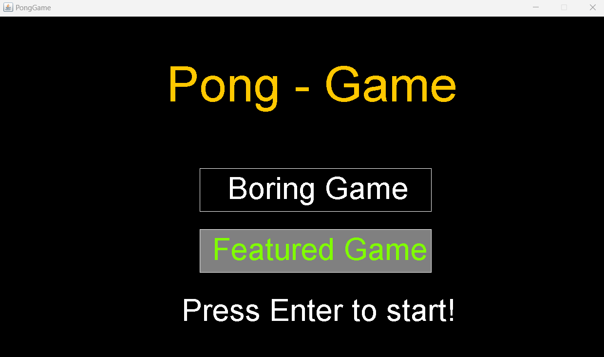
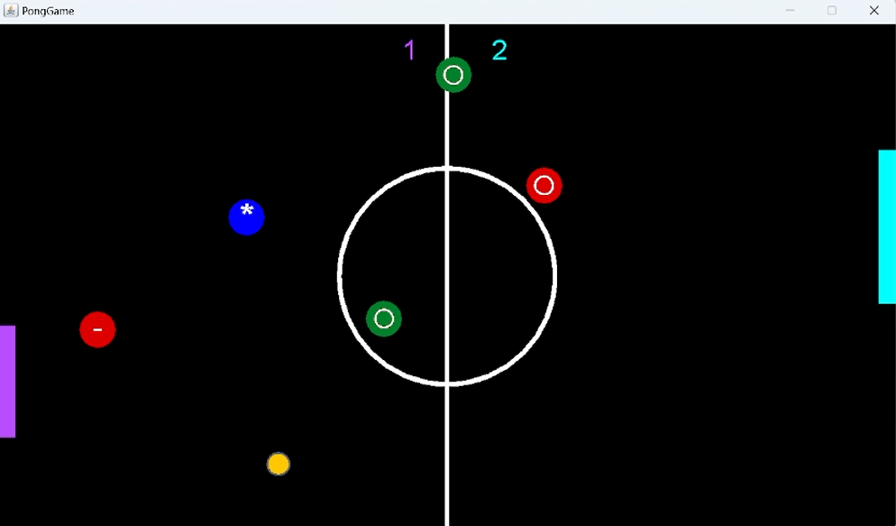
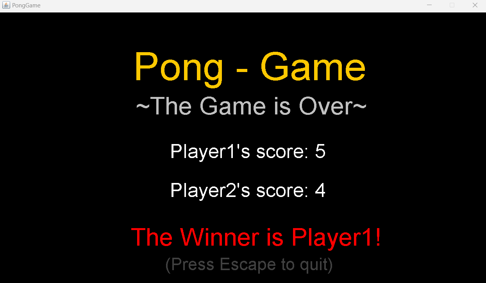

# Advanced-Pong-Game
No boring Pong Game anymore! This version will improve your game experience.

The openning screen includes 2 options:
1. Boring Game - this is the regular known pong game. It has two players, the left player which presented as purple rectangle and the right player which presented as cyan rectangle. The players can move in the vertical direction only. The users can control the left and right players with w,s and up,down keys respectively. The goal of each player is to avoid the ball passing over to his side. The score is shown in the top of the screen. The first player reaches 5 points wins.
2. Featured Game - this is the advanced version of pong game. The boring game principles as described above stay the same. In addition, pop up upgrades will show up throughout the game. The game inserts one new upgrade any few seconds. When the ball hits an upgrade, the game is affected in some way.

The upgrades are separated into 3 different types:
1. Players size changer - if the ball hits it, then one of the players size will be changed (which player? you don't know). If it a green colored circle with a plus sign on it then the player gets bigger, otherwise it is a red colored circle with a minuse sign on it and then the player gets smaller. There are minimal and maximal length limits so don't panik :).
2. Ball size changer - if the ball hits it, then the ball radius will be changed. If this upgrade presented as green/red circle with thin white circle inside then the ball will get bigger/smaller. Also here, there are minimal and maximal size limits for the ball radius so don't panik :).
3. Ball velocity changer - this upgrade presented as a blue circle with asterisk sign (*) in it. if the ball hits it, then the velocity of the ball (direction and power) changes to some other random velocity (direction and power). So prepare to be surprised! here you can panik..

Note: If the ball passed to some side, it automaticlly returns to the center and start moving in a random velocity (direction and power). In this case ,the upgrates were on screen before stays the same. Of course, an upgrade disappears after the ball hits it.

In the ending screen will be the final score of the game and an anouncment of the winner!

## Installation
In order to play the game, follow the steps:
* Make sure Java Runtime Environment (JRE) or Java Development Kit (JDK) is installed on your PC and properly configured.
* Download the `AdvancedPongGame.jar` file.
* Run the command: `java -jar AdvancedPongGame.jar`.

Good Luck!
